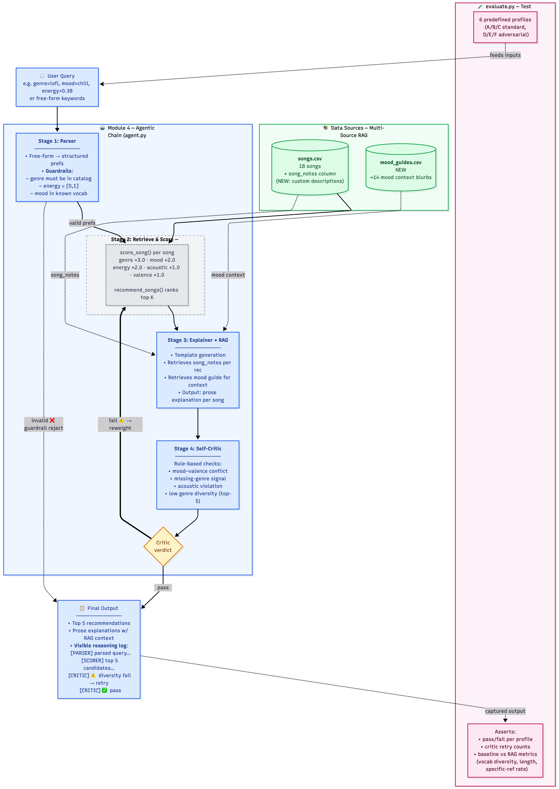

# 🎵 VibeFinder 2.0: Music Recommender with Agentic Reasoning

**Module 4 Final Project, CodePath AI 110**  
Author: Ashley Qu

VibeFinder 2.0 is a rule-based music recommender built as a multi-stage agent. Given either a structured preference dict or a free-form query like `"chill lofi for studying"`, it parses the input, scores 18 songs from a catalog, retrieves custom-written context from two document sources, runs a self-critique loop that can rerank results when something looks off, and returns a top-5 list with prose explanations.

There is no LLM call anywhere in the pipeline. The "agent" here is a rule chain with observable decision points, which keeps it deterministic, reproducible, and free to run.

---

## 🧱 Base Project

The original project is **VibeFinder 1.0** from Module 3. It is a content-based recommender that scores each song in an 18-song catalog against a user profile (favorite genre, favorite mood, target energy, acoustic preference) using a hand-tuned weighted formula out of 9.0 points. The top-5 is returned with a short reason string per song.

Full Module 3 documentation (the scoring formula breakdown, experiment log, bias analysis, and per-profile output screenshots) is preserved at [`docs/MODULE_3_ORIGINAL.md`](docs/MODULE_3_ORIGINAL.md).

VibeFinder 2.0 treats the Module 3 scorer as a trusted tool the agent calls. The scoring logic was not rewritten. The only change to `src/recommender.py` is one additive line in `load_songs` that surfaces a new `song_notes` column for the RAG layer, and the scoring formula itself is unchanged.

---

## 🚀 What's New in Module 4

Five additions wrapped around the Module 3 baseline:

1. **Parser** (`src/parser.py`): accepts structured dicts *or* free-form English queries. Enforces input guardrails (energy in `[0, 1]`, known moods, catalog-present genres).

2. **Multi-source RAG corpus** (`data/songs.csv` + `data/mood_guides.csv`): two hand-written document sources. Every song has a 1 to 2 sentence custom description. Every mood has a context blurb. Generated from a versioned script (`build_data.py`), not templated.

3. **Explainer with dual modes** (`src/explainer.py`): produces prose per recommendation. RAG mode injects `song_notes` and `mood_guide` content; baseline mode uses only structured columns. The dual design is what makes RAG's impact measurable (see Testing Summary).

4. **Rule-based Self-Critic + Rerank** (`src/critic.py`): four checks on the top-5 (`mood_valence_conflict`, `missing_genre`, `acoustic_violation`, `low_diversity`), each with its own retryability flag. Retryable failures trigger a single rerank pass on the full candidate pool using critic-supplied hints (soft penalties for valence and diversity; hard filter for acoustic).

5. **Agent orchestrator** (`src/agent.py` + CLI `src/agent_runner.py`): ties it all together. Max 1 retry. Residual issues after retry are surfaced to the user, not suppressed.

Plus a behavioral and RAG-metric test harness in `evaluate.py`.

---

## 🏗 System Architecture



Gray dashed boxes are Module 3 components retained as-is. Blue boxes are Module 4 additions. Green cylinders are the RAG data sources. The yellow diamond is the Critic's decision point. The pink section is the test harness, which calls the whole chain end-to-end.

**Happy path**: user query → Parser validates → Module 3 scorer ranks all 18 songs → Explainer adds RAG context to the top-5 → Critic approves → output.

**Retry path**: if the Critic rejects the top-5 on a retryable rule, the agent reweights and reranks the full candidate pool, then runs the Critic once more for transparency (not a second retry). Max 1 retry.

**Guardrail path**: Parser rejects malformed input and short-circuits to the output with a human-readable error.

Mermaid source: [`assets/architecture.md`](assets/architecture.md).

---

## ⚙️ Setup & Run

Python 3.9+ is required. No external packages needed for the core agent.

```bash
git clone https://github.com/Ashleyyq/ai110-module4show-applied-ai-system-project.git
cd ai110-module4show-applied-ai-system-project

# Optional: install requirements (only needed for the legacy Streamlit UI)
pip install -r requirements.txt

# Module 3 baseline (sanity check, same output as before)
python -m src.main

# Module 4 agent
python -m src.agent_runner                                     # all 6 profiles
python -m src.agent_runner --profile D                         # one profile
python -m src.agent_runner --query "high-energy rock for gym"  # free-form NL
python -m src.agent_runner --profile B --no-rag                # baseline Explainer
python -m src.agent_runner --profile B --quiet                 # hide internal logs

# Test harness
python evaluate.py                                             # pass/fail + RAG metrics
python evaluate.py --verbose                                   # include agent logs

# Rebuild CSV data (only needed if you edit build_data.py)
python build_data.py
```

---

## 💡 Sample Interactions

Three runs that together cover the main behaviors: critic triggering a productive rerank, critic choosing *not* to retry, and natural-language input.

### Example 1: Profile D (sad but energetic). Critic catches the bias.

Input:
```
favorite_genre = edm
favorite_mood  = sad
target_energy  = 0.90
likes_acoustic = False
```

The Module 3 baseline gives this user "Drop Zone" at #1, which is an EDM song with valence 0.82 and a mood label of "euphoric". That is clearly wrong for someone who said their mood is sad. The root cause is that the +3.0 genre bonus overwhelms the valence mismatch in the linear scoring formula.

The agent catches it:

```
[PARSER] structured → genre='edm' mood='sad' energy=0.9 acoustic=False | valid=True
[SCORER] scored 18 songs; top-1 = 'Drop Zone' score=6.31
[CRITIC] ⚠️  fail: ['mood_valence_conflict'] → retry with {'valence_penalty_weight': 5.0}
[AGENT] retry 1/1 — applying hints
[CRITIC] reranking 18 candidates
[CRITIC] ⚠️  fail: ['acoustic_violation']
[AGENT] residual issues after retry — 1-retry cap honored, surfacing to user
```

Result:
```
#1  Empty Chairs    (soul,  sad,      valence 0.28, score 4.05)
#2  Drop Zone       (edm,   euphoric, valence 0.82, score 3.61)
#3  Iron Collapse   (metal, angry,    valence 0.22, score 3.46)
...

⚠️  Residual issues after retry (1-retry cap, surfaced):
    · User likes_acoustic=False but Empty Chairs has acousticness=0.81
```

"Empty Chairs" moves to #1 and is actually a sad song. "Drop Zone" drops to #2. The agent also honestly flags that "Empty Chairs" violates the non-acoustic preference. The user's profile is partially self-contradictory (being simultaneously sad, EDM-loving, high-energy, and non-acoustic isn't satisfiable in an 18-song catalog), so the agent reports the trade-off instead of pretending it solved everything.

### Example 2: Profile E (country). Critic chooses not to retry.

Input:
```
favorite_genre = country
favorite_mood  = relaxed
target_energy  = 0.38
likes_acoustic = True
```

No country songs exist in the catalog. The critic flags `missing_genre` as a warning, not a failure, because no amount of rescoring can conjure a missing genre. It does not trigger a retry:

```
ℹ️   Critic warnings:
    · Genre 'country' is not present in the catalog. Recommendations fell 
      back to mood + numeric proximity.

#1  Coffee Shop Stories   Slow Stereo   (jazz, relaxed, score 5.81)
#2  Library Rain          Paper Lanterns (lofi, chill,  score 3.75)
#3  Spacewalk Thoughts    Orbit Bloom   (ambient, chill, score 3.72)
```

This is a deliberate choice. Pretending to "fix" a structural limit would be more dishonest than simply telling the user "we don't have country".

### Example 3: Natural-language query.

Input: `"high-energy rock for the gym"`

```
[PARSER] nl 'high-energy rock for the gym' → genre='rock' mood='energetic' 
         energy=0.88 acoustic=False | valid=True
[SCORER] scored 18 songs; top-1 = 'Storm Runner' score=6.60
[CRITIC] ✅ pass (all checks clean)

#1  Storm Runner, Voltline (score 6.60)
    "Driving guitars with no quiet moments. A straight shot of adrenaline 
     for workouts where you'd rather not think. The 'energetic' mood family:
     High-arousal territory meant to push effort output. Less emotional 
     than intense, more task-oriented. Genre matches (rock); the mood is 
     intense rather than your preferred energetic. Energy (0.91) is very 
     close to your target (0.88)."
```

The parser maps "high-energy" to energy≈0.88, "rock" to genre=rock, and "gym" to mood=energetic. Critic passes cleanly on the first try. The RAG-enhanced explanation pulls from both `song_notes` (the "driving guitars" sentence) and `mood_guides` (the "'energetic' mood family:" sentence).

---

## ✅ Testing Summary

`evaluate.py` runs 8 behavioral assertions and a RAG-vs-baseline comparison across 6 profiles.

```
BEHAVIORAL TESTS (8)
────────────────────────────────────────────────────────
[ PASS ] A  rock/intense standard          clean pass
[ PASS ] B  lofi/chill standard            clean pass
[ PASS ] C  pop/happy standard             clean pass
[ PASS ] D  sad/EDM adversarial            retry fired (mood_valence_conflict)
[ PASS ] E  missing genre (country)        clean pass with warnings
[ PASS ] F  acoustic rocker adversarial    retry fired (acoustic_violation)
[ PASS ] G  NL: high-energy rock for gym   clean pass
[ PASS ] H  gibberish input (guardrail)    guardrail rejected
Total: 8 / 8 passed

RAG vs BASELINE (mean across 6 profiles)
────────────────────────────────────────────────────────
Metric                          Baseline    RAG       Δ
Avg explanation length (words)   34.9      71.0    +104%
Unique vocab tokens              71.7     145.0    +102%
Recs referencing song_notes       0%       100%
Recs referencing mood_guides      0%       100%
```

Per-profile length deltas range from +92% (Profile E) to +118% (Profile B). The RAG improvement is consistent, not driven by any single profile.

**What testing caught during development.** A duplicate-definition bug in `recommender.py` where a stub `score_song` at the bottom of the file was silently shadowing the working implementation. My original Module 3 test suite did not catch this because the tests imported the unfinished OOP classes (`Song`, `UserProfile`, `Recommender`), while the live code path used the procedural `score_song` and `recommend_songs` pair. The tests were targeting dead code. The new `evaluate.py` calls the full pipeline end-to-end, so a shadowed stub would not survive a single run.

**What testing did not catch.** The NL parser has a "silence means False" issue. If a user types `"chill lofi for studying"` without explicitly mentioning acoustic preference, the parser defaults `likes_acoustic=False`. The critic then honestly enforces that default, which is internally consistent but may not match what the user actually intended. This is a real limitation of rule-based NL parsing and is documented in the model card.

---

## 🎨 Design Decisions & Trade-offs

**Rule-based, not LLM-backed.** The entire agent is deterministic. No API calls, no keys to configure, no inference latency, no cost. Anyone who clones the repo can run everything immediately, and the test harness is stable across runs. The trade-off is that "reasoning" here is handcrafted rules rather than emergent behavior, and the NL parser only handles patterns I explicitly coded.

**Not every critic failure triggers a retry.** `missing_genre` is non-retryable by design. No amount of reweighting can conjure a missing genre, so pretending otherwise would be dishonest. The other three checks are retryable because each maps onto a concrete reweighting action.

**Hard filter for acoustic, soft penalty for the rest.** Acousticness gets a hard threshold filter on retry (keep only songs on the user's side of 0.5). Mood-valence conflict gets a soft per-song penalty. A soft penalty alone is not strong enough to overcome the +3.0 genre bonus when the user's preferred genre is entirely non-acoustic. Verified on Profile F: with a penalty-only approach, Storm Runner (rock, acousticness 0.10) still wins against genuinely acoustic candidates. With the hard filter, the top-5 correctly switches to acousticness ≥ 0.5.

**1-retry cap, even when issues remain.** Profile D exposes why this is right. After the first retry fixes the mood-valence conflict, the new top-1 triggers a different critic issue (acoustic violation). Looping indefinitely would be dishonest, because the user's profile itself is partially self-contradictory. The agent commits to its best effort after one retry and surfaces the remaining trade-off.

**Reranked scores can be lower than baseline scores, and that is correct.** Profile F's reranked top-5 all score around 2.7, versus the baseline max of 7.96. The rerank filtered away the songs that were piling up genre+mood bonuses. Lower score does not mean worse recommendation. It means the output reflects more of the user's actual constraints.

---

## 🎥 Demo Video

Loom walkthrough: **[link to be added]**

The video shows:
- End-to-end runs with 3 example inputs (Profile D adversarial, Profile E missing-genre, NL query)
- Critic retry behavior visible in the `[AGENT]` and `[CRITIC]` log lines
- `evaluate.py` output with the 8/8 pass table and the RAG metrics
- Brief discussion of the key design choices

---

## 📎 Related Files

| Path | Description |
|---|---|
| [`assets/architecture.png`](assets/architecture.png) | System architecture diagram |
| [`assets/architecture.md`](assets/architecture.md) | Mermaid source for the diagram |
| [`model_card.md`](model_card.md) | Reflection, bias analysis, AI collaboration log |
| [`docs/MODULE_3_ORIGINAL.md`](docs/MODULE_3_ORIGINAL.md) | Preserved Module 3 documentation |
| [`docs/flowchart.md`](docs/flowchart.md) | Original Module 3 data flow diagram |
