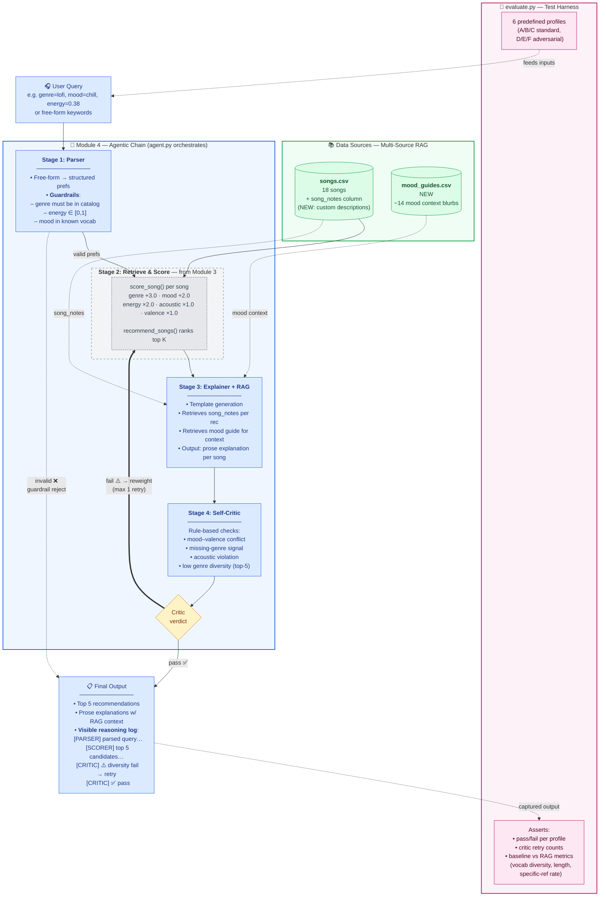

# System Architecture — Module 4 Extended

> Visual convention:
> - **Gray / dashed** = Module 3 baseline components retained as-is
> - **Blue** = Module 4 new components (agentic chain, RAG, critic)
> - **Green** = data sources
> - **Yellow diamond** = decision points (agent reasoning)
> - **Pink** = evaluation harness (runs the whole thing end-to-end for testing)

## Reading the diagram

**Happy path** (solid blue arrows):
User query → Parser validates → Baseline scorer ranks songs → Explainer adds RAG context → Critic approves → Output.

**Retry path** (bold arrow back to scorer):
If Critic detects a problem (e.g., 5/5 results are the same genre, or mood conflicts with top result's valence), it adjusts scoring weights and loops back to the scorer once. Max one retry to prevent loops.

**Guardrail path** (dashed reject arrow):
If Parser detects invalid input (genre not in catalog, energy out of range), it short-circuits to Output with an error message — no wasted scoring pass.

**Why the Module 3 core is visually "inside" the agent:**
The baseline scorer is unchanged — it's a tool the agent calls, not something we rewrote. This makes the "substantial new AI feature" obvious: everything blue is new, everything gray is preserved.