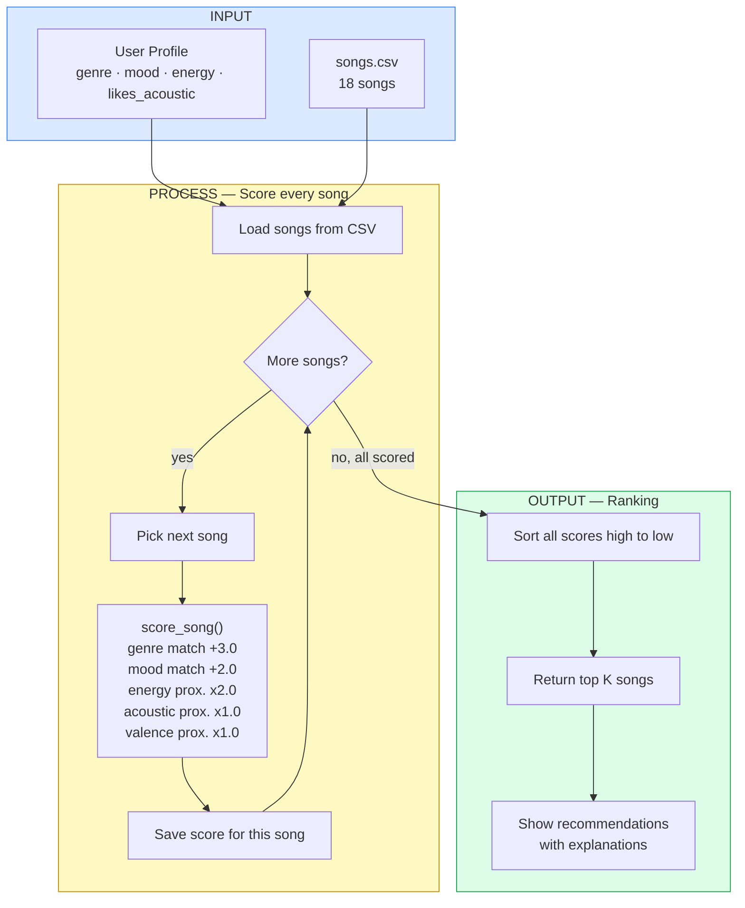

# Music Recommender — Data Flow

```mermaid
flowchart TD

    subgraph INPUT["INPUT"]
        A["User Profile<br/>genre · mood · energy · likes_acoustic"]
        B["songs.csv<br/>18 songs"]
    end

    subgraph PROCESS["PROCESS — Score every song"]
        C["Load songs from CSV"]
        D["Pick next song"]
        E{"More songs?"}
        F["score_song()<br/>genre match   +3.0<br/>mood match    +2.0<br/>energy prox.  x2.0<br/>acoustic prox. x1.0<br/>valence prox. x1.0"]
        G["Save score for this song"]
    end

    subgraph OUTPUT["OUTPUT — Ranking"]
        H["Sort all scores high to low"]
        I["Return top K songs"]
        J["Show recommendations<br/>with explanations"]
    end

    A --> C
    B --> C
    C --> E
    E -->|yes| D
    D --> F
    F --> G
    G --> E
    E -->|no, all scored| H
    H --> I
    I --> J

    style INPUT fill:#dbeafe,stroke:#3b82f6
    style PROCESS fill:#fef9c3,stroke:#ca8a04
    style OUTPUT fill:#dcfce7,stroke:#16a34a
```
